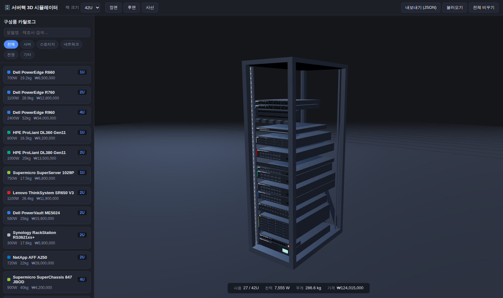

# 서버랙 3D 시뮬레이터

서버랙 구성을 실제 장비 도입 전에 **가상 3D 환경에서 미리 시뮬레이션**해 볼 수 있는 웹 애플리케이션입니다.
카탈로그에서 시판 구성품(서버·스토리지·스위치·UPS 등)을 선택하면 절차적으로 3D 모델링되어 랙에 배치됩니다.



## 주요 기능

- **19인치 표준 랙 3D 시뮬레이션** — 12U / 24U / 42U / 48U 크기 선택, U 눈금 표시
- **구성품 카탈로그** — Dell·HPE·Supermicro·Lenovo 서버, Synology·NetApp 스토리지,
  Cisco·Arista·Juniper 스위치, APC·Eaton UPS/PDU 등 실제 시판 장비 사양(U 높이·깊이·전력·무게·가격) 기반
- **절차적 3D 모델링** — 드라이브 베이, 네트워크 포트, LED, LCD, 통풍구 등 장비 유형별 전면 디테일 자동 생성
- **직관적 배치** — 카탈로그 클릭 → 랙의 원하는 U 위치 클릭으로 장착
  - 배치 가능/불가 위치를 초록/빨강 고스트로 미리보기
  - `Shift`+클릭으로 연속 배치, `ESC`로 취소
  - 슬롯 충돌(이미 장착된 위치) 자동 차단
- **편집** — 드래그로 위치 이동, 선택 후 ▲/▼ 이동·복제·제거, `Delete` 키 제거
- **실시간 집계** — 사용 U 수, 총 소비전력(W), 총 무게(kg), 총 도입 비용(₩)
- **저장/공유** — 브라우저 자동 저장(localStorage), JSON 내보내기/불러오기
- **카메라 프리셋** — 정면 / 후면 / 사선 뷰, 마우스 궤도 회전·줌

## 실행 방법

```bash
npm install
npm run dev        # 개발 서버 (http://localhost:5173)
```

프로덕션 빌드:

```bash
npm run build      # dist/ 에 정적 파일 생성
npm run preview    # 빌드 결과 미리보기
```

## 조작법

| 동작 | 방법 |
|---|---|
| 구성품 장착 | 카탈로그에서 클릭 → 랙의 원하는 위치 클릭 |
| 연속 장착 | `Shift` + 클릭 |
| 장착 취소 | `ESC` 또는 카탈로그 항목 재클릭 |
| 유닛 선택 | 랙의 유닛 클릭 |
| 유닛 이동 | 유닛을 위/아래로 드래그 |
| 유닛 제거 | 선택 후 `Delete` 키 또는 제거 버튼 |
| 카메라 회전 | 빈 공간 드래그 |
| 확대/축소 | 마우스 휠 |

## 기술 스택

- [Three.js](https://threejs.org/) — 3D 렌더링 (모든 장비 모델은 외부 에셋 없이 절차적 생성)
- [Vite](https://vitejs.dev/) — 개발 서버 및 번들링
- 순수 JavaScript (프레임워크 없음)

## 구조

```
index.html          앱 레이아웃 (툴바·카탈로그·뷰포트·인스펙터)
src/
  main.js           씬 구성, 인터랙션, UI 로직
  rack.js           랙 프레임 모델링 + 슬롯 점유 관리
  models.js         구성품 절차적 3D 모델링 (유형별 전면 디테일)
  catalog.js        구성품 카탈로그 데이터 (실제 장비 사양)
  style.css         다크 테마 UI
```

## 카탈로그 확장

`src/catalog.js`의 `CATALOG` 배열에 항목을 추가하면 됩니다:

```js
{
  id: 'my-server', category: 'server', vendor: 'MyVendor',
  name: 'Custom Server X1', u: 2, depth: 750, power: 900, weight: 24,
  price: 10000000, accent: 0xff8800, style: 'server', bays: 12,
}
```

`style`은 `server` / `storage` / `switch` / `patch` / `ups` / `pdu` / `kvm` / `shelf` / `cable` / `blank` 중
선택하며, 유형에 맞는 전면 디테일이 자동 모델링됩니다.
